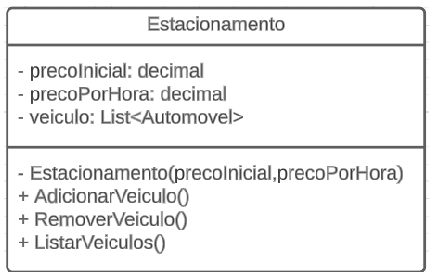
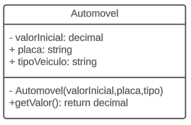

# DIO - Trilha .NET - Fundamentos
www.dio.me

## Contexto
Você foi contratado para construir um sistema para um estacionamento, que será usado para gerenciar os veículos estacionados e realizar suas operações, como por exemplo adicionar um veículo, remover um veículo (e exibir o valor cobrado durante o período) e listar os veículos.

## Descriçao do Código:
Foi construido duas classes chamadas "Estacionamento" e "Automovel" conforme o diagrama abaixo:

## A classe Estacionamento contém um construtor, três variáveis e três métodos, sendo:

**Estacionamento**: Construtor para instanciar a classe. Tem como parametro precoInicial e precoPorHora digitado pelo usuário na inicialização do programa.

**precoInicial**: Variável do tipo decimal. É o preço cobrado para deixar seu veículo estacionado.

**precoPorHora**: Variável do tipo decimal. É o preço por hora que o veículo permanecer estacionado.

**veiculos**: Variável lista de objetos do tipo Automovel, representando uma coleção de veículos estacionados. Cada objeto na lista contém precoInicial, placa e tipoVeiculo (podendo ser corro ou moto)

**AdicionarVeiculo**: Método responsável por receber o tipo do veiculo que está sendo estacionado e uma placa, digitada pelo usuário, instancia um objeto Automovel com os valores fixos no caso de ser um carro ou moto e guardar a referencia do objeto em **veiculos**.

**RemoverVeiculo**: Método responsável por verificar se um determinado veículo está estacionado, e caso positivo, irá pedir a quantidade de horas que ele permaneceu no estacionamento. Após isso, busca os dados necessários no objeto de referencia e realiza o seguinte cálculo: **precoInicial** * **precoPorHora**, exibindo para o usuário.

**ListarVeiculos**: Lista todos os veículos presentes atualmente no estacionamento, mostrando o **TipoVeiculo** e **placa**. Caso não haja nenhum, exibir a mensagem "Não há veículos estacionados".

## A classe Automovel contém um construtor, três variáveis e um métodos, sendo:

**Automovel**: Construtor para instanciar a classe. 
Caso seja um carro tem como parametro (**precoInicial**) digitado pelo usuário,(**placa**) digitado pelo usuário,(**carro**) fixo no codigo. 
Caso seja uma moto tem como parametro (**precoInicial**/2) digitado pelo usuário,(**placa**) digitado pelo usuário,(**moto**) fixo no codigo.

**precoInicial**: Variável do tipo decimal. É o preço cobrado para deixar seu veículo estacionado.

**placa**: Variável do tipo string. É a placa do veiculo estacionado.

**tipoVeiculo**: Variável do tipo string. Se o veiculo é uma moto ou carro.

**getValor**: Método que retorna o valor inicial pago ao entrar no estacionamento.

Por último, um menu interativo com as seguintes ações implementadas:
1. Cadastrar veículo
2. Remover veículo
3. Listar veículos
4. Encerrar

